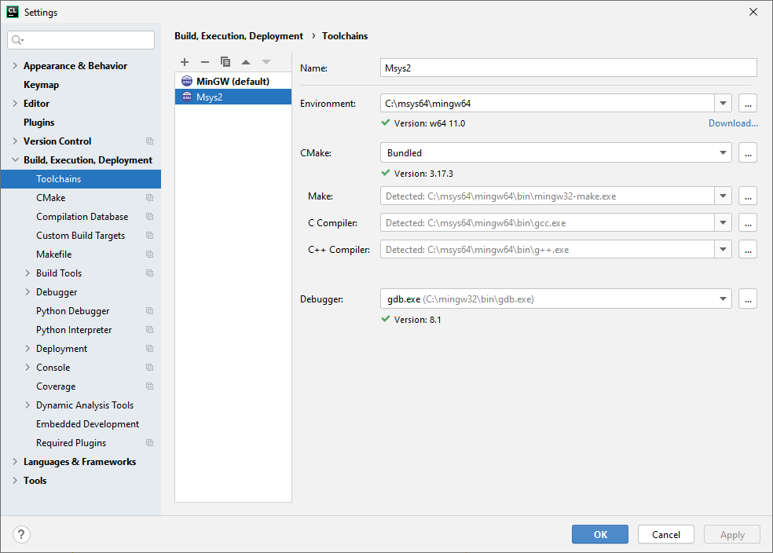
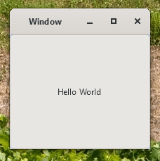

# GTK4 example project

This is a basic *HelloWorld* project for GTK4 on Windows. It is a regular CMake project and should be buildable on any number of platforms.

Having said that, the tech stack I used for it consists of:
- the CLion IDE
- a toolchain based on Msys2 and MinGW64

## Instructions for windows

Download and install Msys2 from [msys2.org](https://www.msys2.org/). Then, open an Msys2 shell and install all build tools and libraries needed: 
```shell
pacman -S mingw-w64-x86_64-gtk4 &&
pacman -S mingw-w64-x86_64-toolchain
```

Next, configure the toolchain. Go to **Settings > Build, Execution, Deployment > Toolchains** and configure your toolchain as shown in the image below.



If you did not make the Msys2 toolchain the default toolchain, go to **Settings > Build, Execution, Deployment > CMake ** and set the Msys2 toolchain there.

> It seems that CLion versions older than 2021.3.4 contain a bug that prevents CLion from detecting the environment correctly. If that is the case, and you cannot upgrade CLion, create a symlink that works around the issue:
> ```shell
> cd msys2/[ucrt64|mingw64]/x86_64-w64-mingw32
> mklink /D include ../include
> ```
> more information [here](https://youtrack.jetbrains.com/issue/CPP-28403/MinGW-headers-update-breaks-MinGW-toolchains-for-Windows)

If all is installed and configured correctly, you can build and run your program by pressing *Shift-F10*:


## Other platforms

.. not sure. Do say so if you can tell me how to build this project elsewhere. It is my intention to build this project myself on Ubuntu latest at some point.